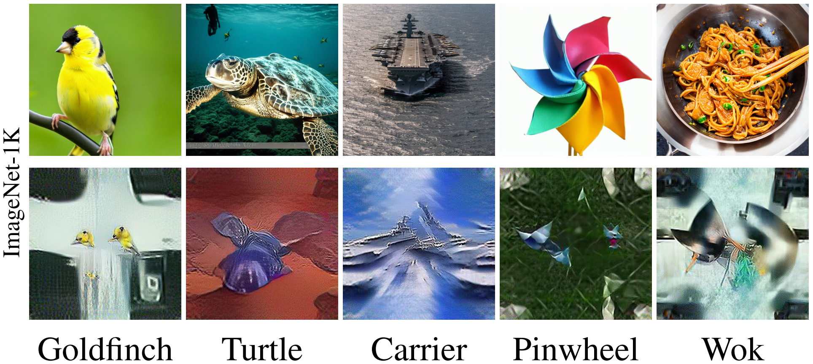
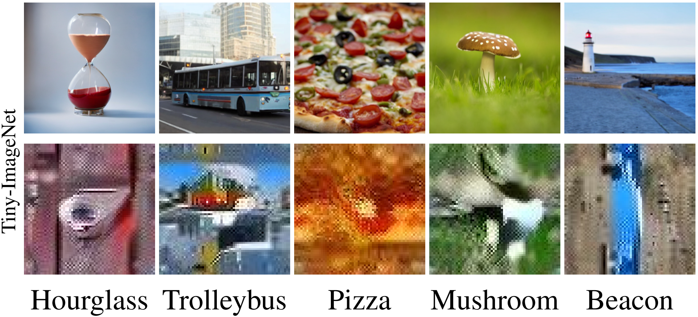
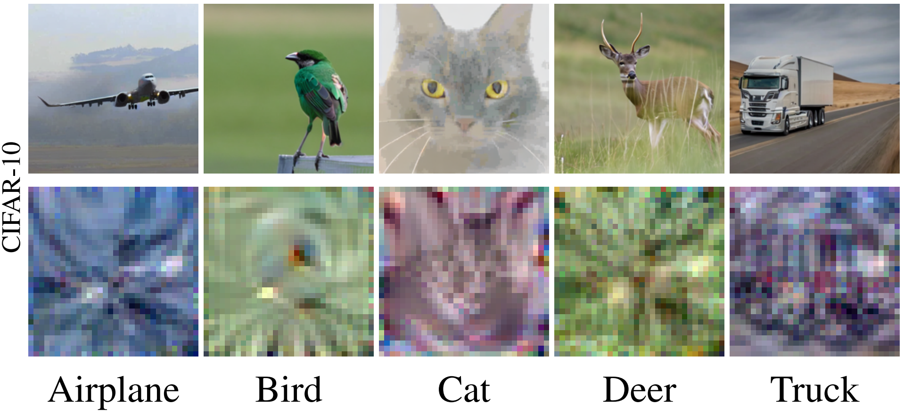
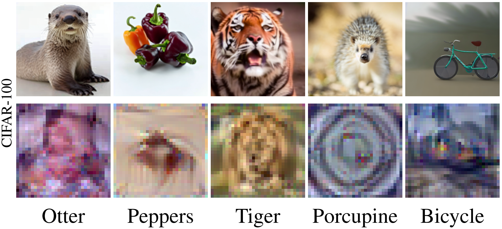

# 💾 D<sup>4</sup>M: Dataset Distillation via Disentangled Diffusion Model

## 💥 Stellar Features
🎯 Distilling Dataset in an Optimization-Free manner. <br>
🎯 The distillation process is Architecture-Free. (Getting over the Cross-Architecture problem.) <br>
🎯 Distilling large-scale datasets (ImageNet-1K) efficiently. <br>
🎯 The distilled datasets are high-quality and versatile. <br>

## 📚 Introduction
Dataset distillation offers a lightweight synthetic dataset for fast network training with promising test accuracy. 
We advocate for designing an economical dataset distillation framework that is independent of the matching architectures.
With empirical observations, we argue that constraining the consistency of the real and synthetic image spaces will enhance the cross-architecture generalization. 
Motivated by this, we introduce Dataset Distillation via Disentangled Diffusion Model (D<sup>4</sup>M), an efficient framework for dataset distillation. 
Compared to architecture-dependent methods, D<sup>4</sup>M employs latent diffusion model to guarantee consistency and incorporates label information into category prototypes.
The distilled datasets are versatile, eliminating the need for repeated generation of distinct datasets for various architectures.
Through comprehensive experiments, D<sup>4</sup>M demonstrates superior performance and robust generalization, surpassing the SOTA methods across most aspects.


<div align="center">
  <em>
    Overview of D<sup>4</sup>M. For more details, please see our 
    <a href="https://arxiv.org/abs/2407.15138">paper</a>.
  </em>
</div>

## 🔧 Quick Start

### Create environment

- Python >=3.9
- Pytorch >= 1.12.1
- Torchvision >= 0.13.1

### Install Diffusers Library

You can install or upgrade the latest version of Diffusers library according to <a href="https://github.com/huggingface/diffusers">this page</a>.

### Modify Diffusers Library

Step 1:
Copy the pipeline scripts (<a href="https://github.com/suduo94/D4M/blob/main/scripts/pipeline_stable_diffusion_gen_latents.py">generate latents pipeline</a> and <a href="https://github.com/suduo94/D4M/blob/main/scripts/pipeline_stable_diffusion_latents2img.py">synthesis images pipeline</a>) into the path of Diffusers Library: `diffusers/src/diffusers/pipelines/stable_diffusion`.

Step 2:
Modify Diffusers source code according to <a href="https://github.com/suduo94/D4M/blob/main/scripts/README.md">scripts/README.md</a>

### Generate Prototypes
``````bash
cd distillation
sh gen_prototype_imgnt.sh
``````

### Synthesis Images
``````bash
cd distillation
sh gen_syn_image_imgnt.sh
``````

## ✨ Qualitative results

### Compare to others

<div align="center">
    <b>
    ImageNet-1K Results (Top: D<sup>4</sup>M, Bottom: SRe<sup>2</sup>L)
    </b>
</div>
<div align="center">

</div>

<div align="center">
    <b>
    Tiny-ImageNet Results (Top: D<sup>4</sup>M, Bottom: SRe<sup>2</sup>L)
    </b>
</div>
<div align="center">

</div>

<div align="center">
    <b>
    CIFAR-10 Results (Top: D<sup>4</sup>M, Bottom: MTT)
    </b>
</div>
<div align="center">

</div>

<div align="center">
    <b>
    CIFAR-100 Results (Top: D<sup>4</sup>M, Bottom: MTT)
    </b>
</div>
<div align="center">

</div>

### Semantic Information

<div align="center">
    <b>
    Distilled data within one class (Top: D<sup>4</sup>M, Bottom: SRe<sup>2</sup>L)
    </b>
</div>
<div align="center">

</div>

> For more qualitative results, please see the supplementary in our <a href="https://arxiv.org/abs/2407.15138">paper</a>.

## 📊 Quantitative results

## 👍🏻 Acknowledgments

Our code is developed based on the following codebases, thanks for sharing！

- <a href="https://github.com/VILA-Lab/SRe2L">Squeeze, Recover and Relabel: Dataset Condensation at ImageNet Scale From A New Perspective</a>
- <a href="https://github.com/szq0214/FKD/tree/main/FKD">FKD: A Fast Knowledge Distillation Framework for Visual Recognition</a>

## 📖 Citation

```
@InProceedings{Su_2024_CVPR,
    author    = {Su, Duo and Hou, Junjie and Gao, Weizhi and Tian, Yingjie and Tang, Bowen},
    title     = {D{\textasciicircum}4M: Dataset Distillation via Disentangled Diffusion Model},
    booktitle = {Proceedings of the IEEE/CVF Conference on Computer Vision and Pattern Recognition (CVPR)},
    month     = {June},
    year      = {2024},
    pages     = {5809-5818}
}
```